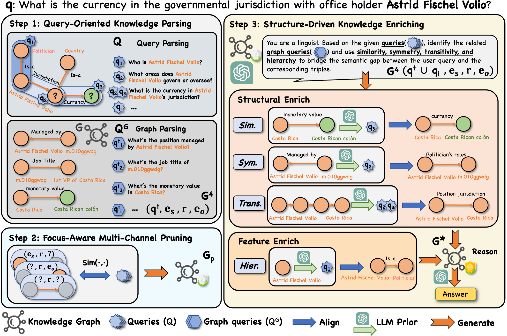

# Enrich-on-Graph

[Paper][EMNLP 2025] *Enrich-on-Graph: Query-Graph Alignment for Complex Reasoning with LLM Enriching*

## 🎨 Overview

## 🚀 Update

 - [x] Our paper is accepted by EMNLP 2025 🎉🎉🎉
 - [x] Our code will be released before September 30th 2025 ✨
 - [ ] Our paper will be published soon ⏳

## 🛠️ Environment

    conda create -n enrich python=3.10
    conda activate enrich
    pip install -r requirements.txt

## 📌 Enrich-on-Graph Workflow
NOTE: Please set your **DATASET_PATH** (e.g. datasets/RoG-cwq), **OPENAI_API_KEY**, **BASE_URL** in the following script. (src/workflow/)

    DATASET_PATH=DATASET_PATH_HERE.parquet
    OPENAI_API_KEY=YOUR_API_KEY_HERE
    BASE_URL=API_BASE_URL_HERE

### Step 1: Parsing

    sh src/workflow/parsing.sh

This action will output question_decompose_datasets containing `user_queries` (sub-queries of complex question) field in preprocess_datasets/ folder.

### Step 2: Pruning

    sh src/workflow/pruning.sh

This action will output llm_pruning_three_channels_datasets containing `pruned_graph` field; as well as triple_trans_datasets containing `triple_unit_queries` (graph queries) field.

We also provide vanilla pruning script, which will output vanilla_pruning_datasets containing `pruned_graph` field.

    python run.py --task vanilla_pruning -d {webqsp, cwq} --embedding_model sentence-transformers  --embedding_model_path {YOUR EMBEDDING MODEL PATH}

### Step 3: Enriching

    sh src/workflow/enriching.sh

This action will output filter_triple_datasets containing `filter_triples` (triples needed to be enriched) field; as well as structural_enrich_datasets containing `structural_enrich_triples` field; also feature_enrich_datasets containing `feature_enrich_triples` field.

## 🏆 Enriched KG

We provide our preprocessed datasets (cwq, webqsp) containing enriched KGs in here (*uploading, coming soon*).

## 💡 Reasoning

Here choose to reason with enriched KGs or vanilla KGs.

    sh src/workflow/reasoning.sh

Type *1* represents Reasoning on vanilla KGs, *2* represents Reasoning with our EoG. *3* represents exit Reasoning.

This action will output qa_datasets containing `predictions` field.

## 📈 Evaluation

Use the following script to eval reasoning results.

    python run.py --task qa_evaluate -d {QA_DATASET_PATH} --cal_f1

## 💖 Citations

Coming Soon 🤗 